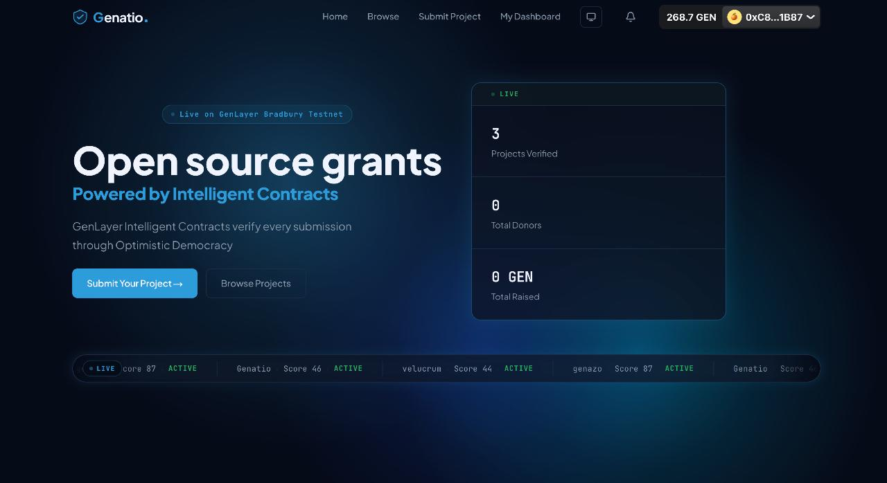
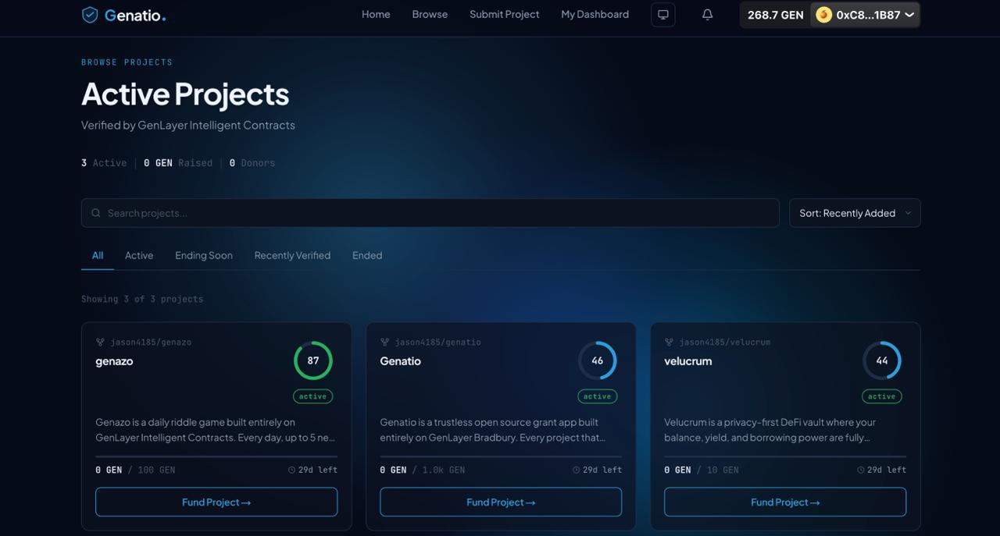
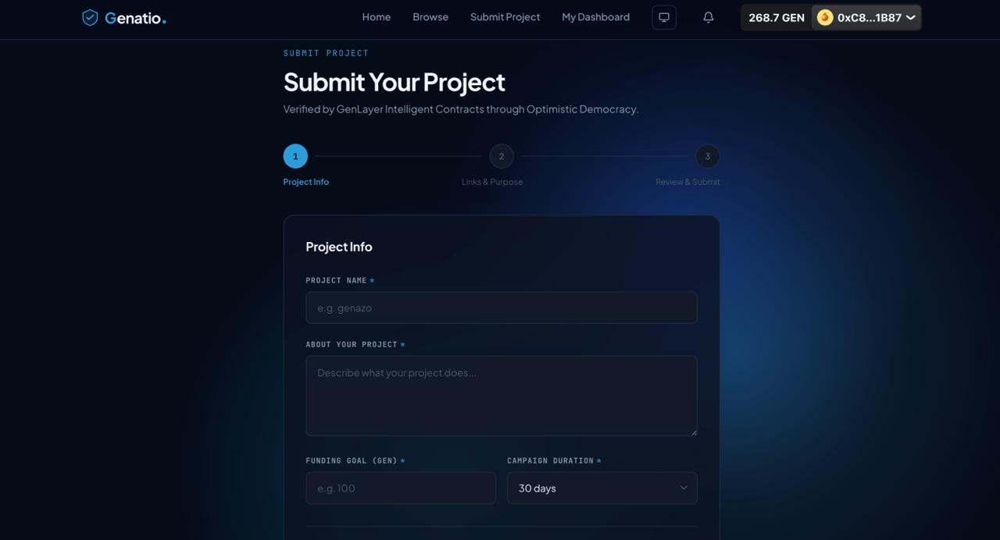
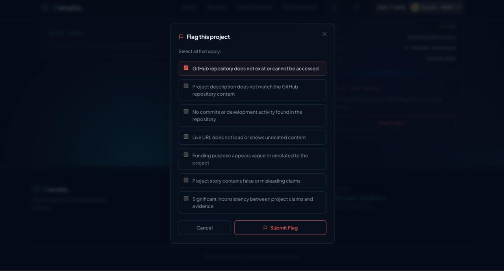

# Genatio

Genatio is a trustless grant discovery and funding app for open source builders, built entirely on GenLayer Bradbury. Every project submitted to Genatio is verified by a GenLayer Intelligent Contract through Optimistic Democracy — five independent validators fetch live GitHub evidence, score the project, and reach consensus on-chain. No human reviews, approves, or rejects anything. Once verified, the project goes live and donors send GEN directly to the builder's wallet. Genatio never custodies funds. It only verifies truth and lets the community act on it.

**Live Demo:** https://genatio.xyz

---

## The Vision

Open source funding today is slow, gatekept, and opaque. Grant committees decide who gets funded based on subjective judgment, personal networks, and closed-door reviews. Genatio removes that layer entirely. An Intelligent Contract reads your GitHub repository, what your project is about, and your funding purpose, and reaches a verifiable on-chain verdict — the same way for every builder, every time. If your project is real and your code is real, you get listed. If your project is fraudulent, the community can flag it and a second Intelligent Contract investigates using the same evidence-based pipeline. Genatio is what happens when grant evaluation is handed to a transparent, consensus-driven machine instead of a committee.

---

## What it does

- GenLayer Intelligent Contracts verify every project submission through Optimistic Democracy
- Five independent validators fetch GitHub data and score projects on-chain
- Donors send GEN directly to the verified builder's wallet — Genatio never holds funds
- Suspicious projects can be flagged and re-investigated by a dispute Intelligent Contract automatically
- Every rejected submission is stored on-chain with a clear reason, and can be resubmitted after fixes

---

## Key Innovation & Technical Pillars

**Trustless Verification, Not Moderation**
Genatio replaces human grant reviewers with an Intelligent Contract that fetches live GitHub evidence and scores submissions against ten weighted factors, normalized through Optimistic Democracy consensus.

**Custom Validator Consensus**
Rather than requiring validators to agree on identical AI text, Genatio uses a custom `validator_fn` that independently cross-checks the leader's score against real GitHub data — rejecting implausible scores deterministically while still allowing natural language variation in AI reasoning.

**Direct Peer-to-Peer Funding**
Genatio does not custody donor funds. GEN moves wallet to wallet, directly from donor to verified builder. The Intelligent Contract's role is strictly limited to verification — never custody.

**On-Chain Dispute Resolution**
A second Intelligent Contract, GenatioDispute, independently fetches the same GitHub evidence when a project is flagged and reaches its own consensus verdict — VALID or INVALID — fully decoupled from the original verification.

**Persistent Rejection Memory**
Rejected submissions are not discarded. They are stored on-chain with the AI's reasoning, visible to the builder on their dashboard, and the same project title can be resubmitted once the underlying issues are fixed.

---

## UI Tour

### Landing Page
Genatio greets visitors with live on-chain stats and recently verified projects. Connect your wallet to submit a project or fund one directly.

### Browse Projects
All verified projects are listed publicly. Browse active grants, see AI verification scores, and fund projects you believe in directly on-chain.

### Submit Project
Builders submit their open source project with a GitHub URL, what the project is about, and a funding goal. GenLayer Intelligent Contracts fetch the GitHub data and score the project through Optimistic Democracy — no human reviews anything.

### Flag a Project
Community members can flag suspicious projects. A dispute Intelligent Contract re-investigates using the same evidence-based pipeline and executes the outcome automatically on-chain.

---

## How it works

1. Creator connects wallet and submits project with GitHub URL, about your project, and funding goal
2. GenLayer Intelligent Contract fetches GitHub data and scores the project through Optimistic Democracy
3. Projects scoring 40+ go live immediately — donors fund them directly wallet to wallet
4. Anyone can flag suspicious projects — a dispute Intelligent Contract re-investigates using the same pipeline
5. Rejected projects are stored on-chain with a clear reason and can be resubmitted with the same title once fixed

---

## Frontend Web Console Features

- **Live Dashboard** — every connected wallet sees their own submission history, including pending verifications, approved projects, and rejected attempts with AI-provided reasons
- **Real-Time Submission Banner** — a persistent banner tracks verification status across the app and updates automatically the moment a verdict lands on-chain, no page refresh required
- **Notification Bell** — surfaces recent approvals, rejections, and flag resolutions for the connected wallet only
- **Direct Funding Modal** — displays the verified project wallet and triggers a native wallet transaction, no intermediary contract step
- **Flag Investigation Modal** — walks the user through reason selection, live consensus polling, and a clear VALID/INVALID resolution with reasoning
- **Score Visualization** — animated score ring with strengths and weaknesses breakdown on the verification result page
- **Dark/Light/System Theme** — full theme support using CSS custom properties, zero hardcoded colors
- **Smart Polling** — aggressive 5 second polling only while a transaction is actively pending, falling back to 30 second background polling otherwise to protect Bradbury RPC rate limits

---

## Contracts

| Contract | Address |
|----------|---------|
| Genatio | `0xD666F066dCDb27BFFffCc8869c66b2E6A246F1F0` |
| GenatioDispute | `0x49dbBed1fE59f0c868a71Fc57268b943FddF657d` |

Network: GenLayer Bradbury · Chain ID: 4221

---

## Project Structure
genatio/

├── contract/

│   ├── Genatio.py              # Main Intelligent Contract

│   └── GenatioDispute.py       # Dispute Intelligent Contract

├── frontend/

│   ├── app/                    # Next.js pages and API routes

│   ├── components/             # UI components

│   ├── hooks/                  # Contract data hooks

│   └── lib/                    # Contract addresses and wallet config

└── README.md

---

## GenLayer Features Used

- `gl.nondet.web.get()` — GitHub API fetching
- `gl.nondet.web.render()` — Live URL verification
- `gl.nondet.exec_prompt()` — AI project scoring and flag evaluation
- `gl.vm.run_nondet_unsafe()` — Custom validator for consensus
- `gl.vm.Return` — Validator type check in validator_fn
- `gl.message.sender_address` — Wallet identity on every write method
- `gl.message.value` — Transaction value where applicable
- `gl.message_raw['datetime']` — On-chain timestamps
- `@gl.public.view` — All read methods
- `@gl.public.write` — All write methods
- `gl.get_contract_at().view()` — Cross-contract reads
- `gl.get_contract_at().emit()` — Cross-contract writes
- `Address()` — Contract address handling
- `TreeMap[str, str]` — campaigns and rejected project storage
- `DynArray[str]` — blacklist storage
- `u256` — Numeric type for scores

**Total: 16 GenLayer methods across 7 categories**

---

## Configuration & Environment Setup

### Prerequisites
- Node.js 18+
- [Rabby Wallet](https://rabby.io) — recommended for the smoothest experience on GenLayer Bradbury
- Testnet GEN from the [GenLayer Faucet](https://faucet.genlayer.com)

### Local Setup
git clone https://github.com/jason4185/genatio

cd genatio/frontend

npm install

Create `.env.local` in the `frontend/` directory:
NEXT_PUBLIC_TEST_MODE=false

Run the app:
npm run dev

Open `http://localhost:3000`, connect your wallet, and submit a project with a real GitHub URL to see the full verification flow.

---

## Status

### MVP 1 — Current (Live)
- ✅ Project submission with AI verification through Optimistic Democracy
- ✅ Direct peer-to-peer GEN funding — wallet to wallet, no custody
- ✅ Community flag and dispute resolution with independent evidence re-fetching
- ✅ Dashboard with submission and flag history
- ✅ Rejected project storage on-chain with resubmission support
- ✅ Live at genatio.xyz on GenLayer Bradbury

### MVP 2 — Planned
- 📱 Mobile responsive design — full support for all screen sizes and touch devices
- 🔍 On-chain donation verification — GenLayer independently confirms each claimed GEN transfer via the Bradbury explorer API before updating funding stats, with no contract custody required
- 📒 Verified funding tracker — a transparent, tamper-proof funding ledger per project built only from independently verified donations
- ⭐ Builder reputation score — an on-chain reputation badge (NEW / BUILDER / TRUSTED / VERIFIED) derived from a wallet's approval history, rejection patterns, and flag outcomes

---

## Feedback

Genatio is an active GenLayer Builder Program submission. Issues, suggestions, and pull requests are welcome on GitHub. If you find a bug in the verification or dispute logic, please open an issue with the transaction hash so it can be traced on the Bradbury explorer.

---

Built by [Jason](https://x.com/ja__so)

**P.S.** Genatio is itself an open source project — anyone can submit it on Genatio and let the Intelligent Contract verify it.
